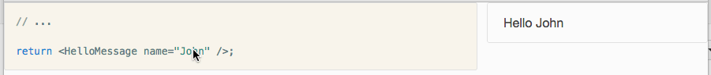

# live coding react components

This repo provides one webpage and three components.

## index.html

A simple example of `<LiveEditor>` in use.

## code-mirror-editor.js

A code mirror react component (called `<CodeMirrorEditor>` since code mirror took the name `CodeMirror`).

## live-compile.js

Dynamic compilation of react components.

## live-editor.js

Combination of `<CodeMirrorEditor>` and `<ComponentPreview>` which live-compiles what you type!

# Running the demo

```
> webpack
> open index.html
```

You should see something like this:


